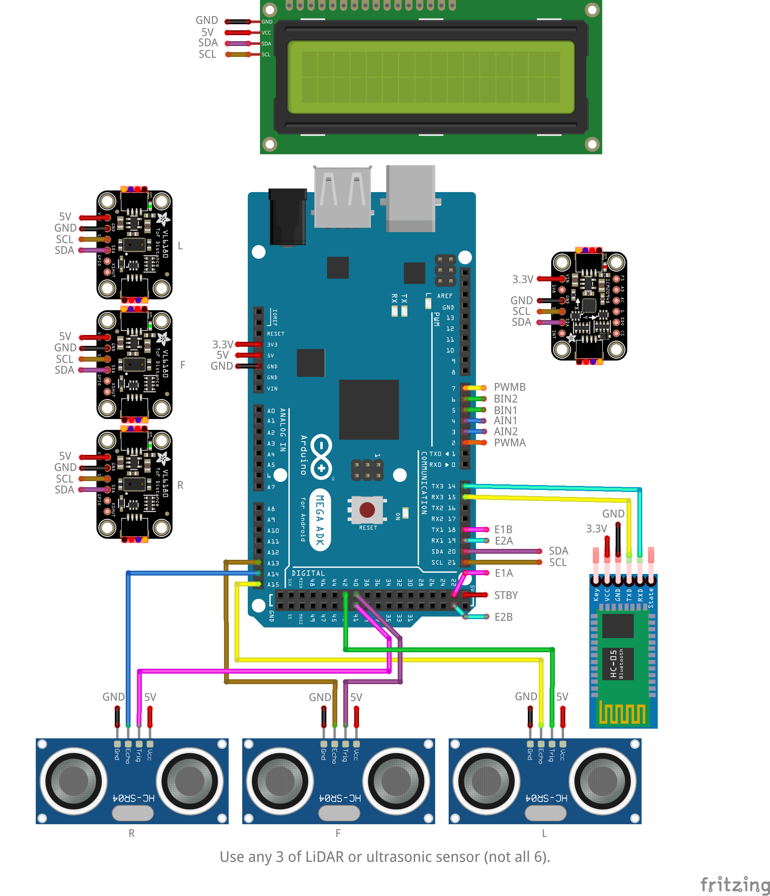
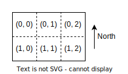
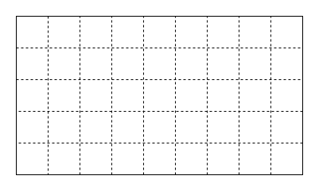
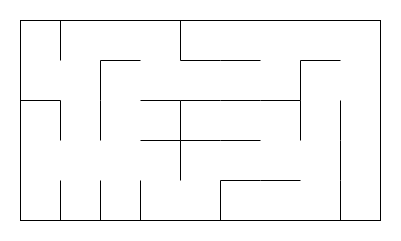

# MTRN3100 Project Specification

## Learning Outcome

- Apply relevant theoretical knowledge pertaining to mobile
robots including locomotion, perception and localisation utilising
onboard sensors, navigation and path planning, for complex
problem-solving.
- Apply general computer vision techniques for feature/object
detection and tracking, for complex problem-solving.
- Demonstrate hands-on skills in mechatronics design,
fabrication, and implementation by completing practical activities.
- Collaborate effectively within a team via participation in a
problem-solving competition.

---

## Team Rules

- Teams must have 4/5 people. Only in exceptional circumstances may teams have 3 people which your lab demonstrator will authorise.
- Teams are to be randomly formed with students from within your own lab session.

---

## Robot Specification

1. The following electronics are required to be installed onto the robot platform:
    - $1 \times$ of any microcontroller of the following: `Arduino MEGA`.
    - $1 \times$ of any motor driver of the following: `L298N`, `TB6612`.
    - $2 \times$ of any motors (with integrated encoders) of the following: `MG310P20`, `25GA370`.
    - $1 \times$ of any IMU of the following: `ICM-20948`, `CJMCU-20948`.
    - $3 \times$ of any distance sensors of the following: `HC-SR04`, `VL6180X`, `VL53L0X`.
    - $1 \times$ of any bluetooth module of the following: `HC-0X` series.
    - Any battery pack.
    - A fuse rated `1.8 A`.
    - A switch (ignore if motor driver already has switch).

    No other electronics are allowed unless permission is given so.

1. The following electronics are optional to install onto the robot platform:
    - Any LCD screen.

    No other electronics are allowed unless permission is given so.

1. The robot must be a two-wheeled driven platform with any number of non-driven wheels.
1. The robot must be able to perceive the distance of obstacles on the left, front, and right side of the robot.
1. The robot must be an untethered platform e.g. it cannot be wired to an external power source or processing unit.
1. The robot must only be electrically powered by a battery.
1. The robot size must fit within a radius of 200 mm and height of 200 mm.
1. All software processing must be done with the on-board computer unless otherwise specified.
1. The robot must not use permanent fastening techniques e.g. epoxy and superglue.

---

## Milestone 0: Integration (0%)

This milestone is worth 0% and serves as an expectation to check that your team is making good progress with the project.

This milestone is due in Week 3 in your scheduled lab time.

### Task

1. The robot has integrated the required electronics onto the platform from the [robot specification](#robot-specification).

    A circuit has been provided as an example of how most of the electronics can be connected to the microcontroller. Note that it may not be possible to power all the devices off the microcontroller so a power supply should be used.

    

1. Integrated components are all powered from the on-board battery.
1. Robot abides by the rest of the robot specification requirements.


### Implementation Hints

Here are some general hints when building the robot:
- Individually test each of the components before assembling it onto the platform.
- Power the 5V devices from the power supply and 3.3V devices from the Arduino as to not overload the Arduino.
- Keep the robot's wheel axis coincident with the maze cell centre so that only purely rotational movements are needed to make a turn (this could be done by placing the wheel axis at the centre of the robot). If the wheel axis is translated then a combination of rotational and translation movements will be required to turn.
- Keep the IMU as close as possible to the robot's turning point.
- Keep the IMU flat as to negate gravitational contribution to acceleration in other axes.
- The LCD screen can be used for debugging purposes.

---

## Milestone 1: Basic Robot Functions (5%)

The purpose of this milestone is to ensure your team's robot has basic working functionality.

This milestone is due in Week 5 in your scheduled lab time.

### Environment

The environment is a grid with the following specification:
- The grid will contain 9 x 5 cells.
- The grid will be enclosed i.e. have closed outer walls.
- Each cell is 250 mm x 250 mm i.e. the distance between centres of neighbouring cells is 250 mm.

The grid will be partitioned so that multiple groups can work in the environment simultaenously.


### Task

- (3 marks) Robot has simple driving capabilities which is to be demonstrated using teleoperation. The teleoperation is not continuous and drives the robot one step at a time per command:
    - 1 mark for driving forward 1 cell (250 mm).
    - 1 mark for turning left 90 degrees on the spot.
    - 1 mark for turning right 90 degrees on the spot.

    There will be a tolerance of $\pm$ 20 mm and $\pm$ 10 degrees for each robot movement.


- (3 marks) Robot can reliably detect a wall on its left, front, and right side when the robot has been placed at the centre of a cell.
    - 1 mark for detecting a wall on left side.
    - 1 mark for detecting a wall on front side.
    - 1 mark for detecting a wall on right side.

    The detection data must be transmitted via bluetooth and displayed.


- (3 marks) Robot shows correct [maze cell pose](#maze-cell-pose) whilst the robot is moving within a 2 x 3 grid with no walls.
    - 1 mark for demonstrating correct `(row, col, head)` when robot has moved forward from initial maze cell pose.
    - 1 mark for demonstrating correct `(row, col, head)` when robot has turned left from initial maze cell pose.
    - 1 mark for robot visiting all cells in the grid with completely correct sequence of `(row, col, head)`.

    The initial maze cell pose can be hardcoded.

    The robot is to be moved using teleoperation.

    The maze cell pose data must be transmitted via bluetooth and printed out.


#### Maze Cell Pose

The maze cell pose is a coordinate system in the form of `(row, col, heading)`. The origin cell `(0, 0)` will always be the top-left of the maze.

The row and column, `(row, col)`, can be deduced from the following grid example:



The possible robot headings are `N`, `E`, `S`, `W`.

### Code Submission

Your team must submit the code used for this milestone to your GitHub team repository by the end of the milestone demonstration. Failure to do so will result in an automatic 0 for this milestone.

### Team Evaluation

There will be a team evaluation available on Moodle for this milestone which will assess you and your teammate's contributions to this milestone. Up to 50% of the milestone marks will be individually adjusted.

There will be a 10% penalty for your milestone mark for non-completion.

If a team member has received an exceptionally poor contribution rating and no comment has been provided, then your rating will be adjusted without your input and any related grievances will not be further investigated.

The team evaluation will be due 1 week after the milestone deadline.

---

## Milestone 2: Closed-Loop Driving (5%)

The purpose of this milestone is to ensure your team's robot has closed-loop driving capabilities. The effectiveness of closed-loop driving will be assessed based on how long the robot can drive whilst minimising accumulation of error.

This milestone is due in Week 9 in your scheduled lab time.

### Environment

The environment is a grid with the following specification:
- The grid will contain 9 x 5 cells.
- The grid will be enclosed i.e. have closed outer walls.
- Each cell is 250 mm x 250 mm.

The following figure is an example of a valid grid where the dashed lines represent maze cell boundaries and the solid lines represent maze boundaries:



The grid will be partitioned so that multiple groups can work in the environment simultaenously.


### Task

- (10 marks) Completeness of the robot following a 10-step [motion plan](#motion-plan). Completing each motion step will grant 1 mark.

    The motion plan may be hardcoded or sent via bluetooth.

    The robot will be considered within a cell if its centroid is within the cell boundary.
    
    The robot heading will have the direction of a cardinal direction (`N`, `E`, `S`, `W`) within the tolerance of $\pm$ 45 degrees of a cardinal direction.

    > Completeness is defined as how much of the motion plan was successfully executed.


- (2 marks) Robot displays accurate turning on the spot after 5 consecutive turns.
    - 2 marks if robot heading is facing the intended heading with little visible error.
    - 1 mark if robot is off by more than 10 degrees.
    - 0 marks if robot is off by more than 45 degrees.

    The robot must start facing a cardinal direction.


- (2 marks) Robot displays accurate forward driving after 8 consecutive forward movements.
    - 2 marks if robot centroid is at the centre of the destination cell with little visible error.
    - 1 mark if robot centroid is within the destination cell.
    - 0 marks if robot centroid is outside the destination cell.

    The robot must start at the centre of its starting cell.


#### Motion Plan

A motion plan is a string where:
- The first three characters represents the initial [maze cell pose](#maze-cell-pose) e.g. `(2, 8, N)` becomes `28N`.
- The remaining characters represents the sequence of motions where:
    - `F` instructs the robot to move one cell forward.
    - `L` instructs the robot turn left on the spot.
    - `R` instructs the robot turn right on the spot.

An example motion plan is as follows: `00SFFLR`. The robot is at position `(0, 0)` facing south, and will move forward, forward, turn left, then turn right.

### Code Submission

Your team must submit the code used for this milestone to your GitHub team repository by the end of the milestone demonstration. Failure to do so will result in an automatic 0 for this milestone.

### Team Evaluation

There will be a team evaluation available on Moodle for this milestone which will assess you and your teammate's contributions to this milestone. Up to 50% of the milestone marks will be individually adjusted.

There will be a 10% penalty for your milestone mark for non-completion.

If a team member has received an exceptionally poor contribution rating and no comment has been provided, then your rating will be adjusted without your input and any related grievances will not be further investigated.

The team evaluation will be due 1 week after the milestone deadline.

---

## Milestone 3: Maze Mapping & Solving (20%)

This final milestone is the competition which consists of two phases (maze mapping and maze solving) and a quality check.

Two approaches are allowed for maze mapping i.e.:
- autonomous exploration; or,
- computer vision.

This milestone is due in Week 13 in your scheduled lab time.

### Environment

The environment is a maze with the following specification:
- The maze will contain 9 x 5 cells.
- The maze will be enclosed i.e. have closed outer walls.
- Each cell is 250 mm x 250 mm.
- The height of the maze walls is 250 mm.
- The maze will never contain an isolated cell.

The following figure is an example of a valid maze:




### Maze Mapping Phase (10 marks)

The objective of this phase is to use the bird's eye camera above the maze to build a map of the maze.

Rules:
1. An image of the maze can only be obtained from the bird's eye camera.
1. The team must process the image of the maze on a master device (e.g. laptop).
1. The maze data can only be sent to the robot via bluetooth.
1. No path planning algorithms are to be used yet for this phase.

Scoring:
- (10 marks) Correctness and completeness of the [maze map](#maze-map) shown after processing.

    <table>
        <tr>
            <th>Completeness (%)</th>
            <th>Mark</th>
        </tr>
        <tr>
            <td>[0, 10)</td>
            <td>0</td>
        </tr>
        <tr>
            <td>[10, 20)</td>
            <td>1</td>
        </tr>
        <tr>
            <td>[20, 30)</td>
            <td>2</td>
        </tr>
        <tr>
            <td>[30, 40)</td>
            <td>3</td>
        </tr>
        <tr>
            <td>[40, 50)</td>
            <td>4</td>
        </tr>
        <tr>
            <td>[50, 60)</td>
            <td>5</td>
        </tr>
        <tr>
            <td>[60, 70)</td>
            <td>6</td>
        </tr>
        <tr>
            <td>[70, 80)</td>
            <td>7</td>
        </tr>
        <tr>
            <td>[80, 90)</td>
            <td>8</td>
        </tr>
        <tr>
            <td>[90, 100)</td>
            <td>9</td>
        </tr>
        <tr>
            <td>[100]</td>
            <td>10</td>
        </tr>
    </table>

    > Correctness is defined as an existing wall that has been identified in the correct location. Completeness is defined as the number of correct walls identified.


#### Maze Map

A maze map is ASCII art that may look like the following:
```
 --- --- --- --- --- --- --- --- --- 
|               |                   |
     ---                 ---         
|           |           |   |       |
 ---             --- ---     ---     
|       |   |   |                   |
         ---     --- --- ---         
|   |                   |           |
         ---         ---     ---     
|   |           |           |       |
 --- --- --- --- --- --- --- --- --- 
```

### Alternative Maze Mapping Phase (10 marks + X bonus marks)

This is an alternative method to the default maze mapping method:
- If only the default maze mapping phase was completed then the team is not eligible for bonus marks.
- If only the alternative maze mapping phase was completed then the team is eligible for 3 bonus marks.
- If both maze mapping phases were completed then the team is eligible for 5 bonus marks.

The objective of this phase is for the robot to drive around the maze **autonomously** (i.e. with no teleoperation) to build a map of the maze using its on-board sensors given the robot's initial maze cell pose and destination location.

Rules:
1. The team will have 10 minutes (for this phase) to explore the maze as much as possible.
1. The team may have an infinite number of run attempts during this phase.
1. A run is disqualified if:
    - the robot has crashed into a wall; or,
    - the team interferes with the robot.
1. The run will begin when:
    - the robot has been placed at the maze cell pose `00S`; and,
    - the robot has moved from its start position.
1. The run is over when:
    - the timer is up; or,
    - the team/robot decides to end the run early; or,
    - the robot has been disqualified.
1. The phase is over when:
    - the timer is up; or,
    - the team decides to end the phase early.
1. No path planning algorithms are to be used yet for this phase.

Scoring:
- (10 mark) Correctness and completeness of the [maze map](#maze-map) shown at the end of the run.

    <table>
        <tr>
            <th>Completeness (%)</th>
            <th>Mark</th>
        </tr>
        <tr>
            <td>[0, 10)</td>
            <td>0</td>
        </tr>
        <tr>
            <td>[10, 20)</td>
            <td>1</td>
        </tr>
        <tr>
            <td>[20, 30)</td>
            <td>2</td>
        </tr>
        <tr>
            <td>[30, 40)</td>
            <td>3</td>
        </tr>
        <tr>
            <td>[40, 50)</td>
            <td>4</td>
        </tr>
        <tr>
            <td>[50, 60)</td>
            <td>5</td>
        </tr>
        <tr>
            <td>[60, 70)</td>
            <td>6</td>
        </tr>
        <tr>
            <td>[70, 80)</td>
            <td>7</td>
        </tr>
        <tr>
            <td>[80, 90)</td>
            <td>8</td>
        </tr>
        <tr>
            <td>[90, 100)</td>
            <td>9</td>
        </tr>
        <tr>
            <td>[100]</td>
            <td>10</td>
        </tr>
    </table>

    Maze walls that were not detected because the robot did not visit that part of the maze will contribute to this mark.

    The robot at the end of the run should somehow display the maze e.g. via bluetooth, using an LCD screen, etc.


- (X bonus marks) Attempting and achieving at least 50% in this phase will automatically grant X specified bonus marks towards this milestone, as described earlier.


### Maze Solving Phase (11 marks)

The objective of this phase is for the robot to solve the maze for the shortest path between the start and destination cells then drive the robot according to the path plan.

Rules:
1. The team will have 2 minutes (for each run) to solve the maze and reach the destination cell.
1. The team may only have 2 run attempts during this phase.
1. A run is disqualified if:
    - the robot has crashed into a wall; or,
    - the team interferes with the robot.
1. The run will begin when:
    - the robot has received the maze map via bluetooth **if** CV mapping was used; and,
    - the robot has been placed at its starting maze cell pose; and,
    - the robot has received its starting maze cell pose and destination cell via bluetooth; and,
    - the robot has moved from its start position.
1. The run is over when:
    - the timer is up; or,
    - the team decides to end the run early; or,
    - the robot has been disqualified; or,
    - the robot has stopped at its destination.
1. The phase is over when:
    - the team decides to end the phase early; or,
    - the team has exhausted all their allowed runs.

Scoring:
- (1 mark) Identifying a shortest path from the maze and displaying it at the start of each run on the master device via bluetooth.

    The robot must follow the identified path.

    This information can be displayed in the format of a sequence of maze cell poses, visually with the maze map, or as a motion plan.

    > Shortest path is defined as a path with the least number of cells required to travel from start to destination.


- (5 marks) Completeness of following through with the identified path plan.

    <table>
        <tr>
            <th>Completeness (%)</th>
            <th>Mark</th>
        </tr>
        <tr>
            <td>[0]</td>
            <td>0</td>
        </tr>
        <tr>
            <td>(0, 25)</td>
            <td>1</td>
        </tr>
        <tr>
            <td>[25, 50)</td>
            <td>2</td>
        </tr>
        <tr>
            <td>[50, 75)</td>
            <td>3</td>
        </tr>
        <tr>
            <td>[75, 100)</td>
            <td>4</td>
        </tr>
        <tr>
            <td>[100]</td>
            <td>5</td>
        </tr>
    </table>


- (5 marks) Achieving a fast run time. Each mark earned will be based on percentile ranking of the cohort.

    <table>
        <tr>
            <th>Percentile (%)</th>
            <th>Mark</th>
        </tr>
        <tr>
            <td>No participation</td>
            <td>0</td>
        </tr>
        <tr>
            <td>[0, 20)</td>
            <td>1</td>
        </tr>
        <tr>
            <td>[20, 40)</td>
            <td>2</td>
        </tr>
        <tr>
            <td>[40, 60)</td>
            <td>3</td>
        </tr>
        <tr>
            <td>[60, 80)</td>
            <td>4</td>
        </tr>
        <tr>
            <td>[80, 100]</td>
            <td>5</td>
        </tr>
    </table>

    **If any of the [robot specification](#robot-specification) has been failed, then your robot is disqualified from being ranked and earning marks for fastest run time.**


### Quality Check (9 marks)

Scoring:
- (3 marks) Quality of wiring i.e. efficient use of wires, neatness, followability.
- (3 marks) Robustness of assembly i.e. no unstable/loose components on the platform.
- (3 marks) Code style i.e. readable, maintainable, no code smells.

**If any of the [robot specification](#robot-specification) has been failed, then quality check is given an automatic 0.**


### Code Submission

Your team must submit the code used for this milestone to your GitHub team repository by the end of the milestone demonstration. Failure to do so will result in an automatic 0 for this milestone.

### Team Evaluation

There will be a team evaluation available on Moodle for this milestone which will assess you and your teammate's contributions to this milestone. Up to 50% of the milestone marks will be individually adjusted.

There will be a 10% penalty for your milestone mark for non-completion.

If a team member has received an exceptionally poor contribution rating and no comment has been provided, then your rating will be adjusted without your input and any related grievances will not be further investigated.

The team evaluation will be due Week 13 Friday 20:00.

---

## Plagiarism

Don't do it.

If you are caught plagiarising or assisting plagiarism then you and/or your team will be given 0 for a milestone.

In extreme circumstances, you may receive 0 for MTRN3100.

For more information, please read [UNSW's plagiarism policy](https://www.student.unsw.edu.au/plagiarism).
